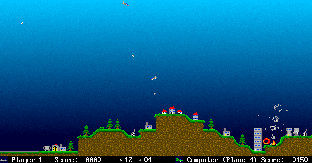

Apricots
========



Overview
--------

Apricots has nothing to do with apricots. It's a game where you fly a little
plane around the screen and shoot things and drop bombs on enemy targets, and
it's meant to be quick and fun.

Installing
----------

Apricots has been tested on Linux and Mac OS. It should also be buildable on
any UNIX platform that meets the requirements below.

Windows support is currently unknown. There was Windows support at one point,
but I don't have access to a Windows machine to check recent changes haven't
broken anything. Contributions are always welcome!

### Requirements


- A C++ compiler (GCC/G++ and Clang/LLVM)
- SDL > 2.0.0, download from www.libsdl.org
- OpenAL, download from www.openal-soft.org
- freealut 1.1.0, download from https://github.com/vancegroup/freealut/releases/tag/freealut_1_1_0

### Buidling from source

```
./configure # use --prefix= if you want to install to somewhere other than /usr/local
make
make install # may require sudo if you don't have permission to write to the target prefix
```

### Building from git

As well as the requirements for building from source, you will require GNU
Autotools. The `bootstrap` script will create the `configure` script for you.

```
./bootstrap
./configure # use --prefix= if you want to install to somewhere other than /usr/local
make
make install # may require sudo if you don't have permission to write to the target prefix
```

History
-------

The orginal author, Mark Snellgrove, wrote the following:

> The original version of the game dates back to around 1991. The very first
> version of the game was written on an Amiga, using the AMOS language, and the
> game was called 'Planegame'. This was a very simple affair with simplistic
> landscapes, no guns or shrapnel, and very limited computer AI. It was also
> dreadfully slow. The AMOS compiler improved things somewhat at a later date.
> A couple of years later I obtained the BLITZ language for the Amiga, and
> ported 'Planegame' carefully over to that, resulting in a huge speedup.
> Impressed by the capabilites of BLITZ, in 1995 I proceeded to rewrite the
> game entirely from scratch, even using completely new graphics and sound. The
> result was 'Planegame2', which, for various reasons also got dubbed
> 'Apricots'. This new version of the game added anti-aircraft guns, shrapnel,
> trees, towers, water, better airbases and a huge improvement on graphics,
> sound, and intelligent computer AI. Slightly later, in 1996, the Draks were
> added as a bit of amusement. The result was a highly playable game, which I
> distributed to a few of my friends. A few years later and I now use a PC,
> which can run Linux  Having learnt C++ by this time, at the beginning of 2002
> I felt ready enough to port 'Apricots' cross platform from BLITZ on the Amiga
> to C++ on a Linux PC. What you see here is work in progress on that port. The
> game has been tweaked slightly while being ported over, so is not identical
> to the Amiga version.

moggers87 took over this project in 2019 as the original website had
disappeared.

Authors
-------

See AUTHORS

Status
------

The game is still under development. Apricots-0.2.7 is a beta release using the
SDL2 library. Despite this, it is highly playable. Please open a Github issue to
report bugs, feature requests, or comments.


Instructions
------------

CONTROLS                 |     PLAYER 1          |   PLAYER 2
-------------------------|-----------------------|-----------
ROTATE LEFT              |     CURSOR LEFT       |   Z
ROTATE RIGHT             |     CURSOR RIGHT      |   C
ACCELERATE / STEALTH     |     CURSOR UP         |   S
DROP BOMB                |     CURSOR DOWN       |   X
FIRE SHOT                |     RETURN            |   LEFT CTRL

Stay alive, and shooting enemy targets gains you points, whereas being shot
down or shooting the wrong things lose you points. You have infinite planes,
and are competing against the other computer planes (or other player!). First
to a certain score wins once they land at base.

Play Options
------------

At present there is no option screen. Options can be changed by editing the
configuration file apricots.cfg. This is first searched for in
~/.config/apricots/, then the system configuration directory (usually
/usr/local/etc or /etc) and finally the default configuration in the data
directory.

The number and type of planes can be varied, along with the airbases, as can
1/2 player game be chosen. The number of anti aircraft guns and scenery can be
selected. Draks can be turned on or off, and a different condition for winning
the game can be chosen.

License
-------

Apricots falls under the GPL. Please read the file COPYING included in this
distrubution. The sourcecode of Apricots will either be included in the
distrubution, or can otherwise be downloaded from the Apricots webpage (see
below)

Webpage
-------

For updates, bugfixes, sourcecode and more info please visit the Apricots
webpage at https://github.com/moggers87/apricots
